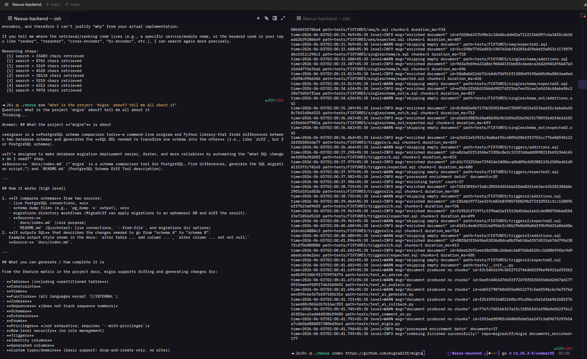
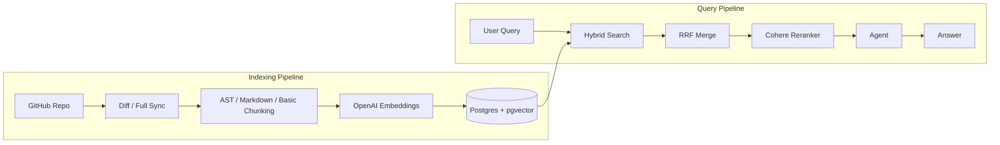

# Nexus Backend

**Nexus**, a personal codebase assistant and knowledge base that indexes repositories/notes, runs background syncing, and handles advanced hybrid-search retrieval and AI-driven question answering.

---



## System Architecture

Nexus operates on two primary pipelines: the **Ingestion & Enrichment Pipeline** and the **Retrieval & Reranking Query Pipeline**.



---

## Why Nexus? (Design & Architectural Decisions)

### 1. The Inefficiency of Fixed-Token Chunking for Code

Standard RAG pipelines split documents into fixed-size chunks (e.g., every 500 tokens with an 80-token overlap). For codebases, this is highly inefficient:

- **Loss of Semantic Context:** A class method or function can be split down the middle, meaning imports, parent declarations, and functional boundaries are lost.
- **Orphaned Symbols:** If a function's code is retrieved without knowing its parent class or file-level exports, the LLM cannot understand what class it belongs to or how it is utilized.

#### AST-Aware Chunking (Tree-sitter)

Nexus solves this using language-specific Abstract Syntax Trees (ASTs). Rather than chunking blindly, it classifies files (using [fileClassfier.go](file:///home/eviltwin7648/Desktop/Nexus/Nexus-backend/internal/chunker/fileClassfier.go)) and parses them using the Tree-sitter library (defined in [internal/parser](file:///home/eviltwin7648/Desktop/Nexus/Nexus-backend/internal/parser)). It extracts distinct code nodes such as **Functions**, **Methods**, **Classes**, **Structs**, **Interfaces**, and **Enums**.

- **Recursive AST Chunking (Design Principle):** If a parsed class or method is larger than the token budget, Nexus recursively splits it deeper (e.g., breaking classes down into methods, and large methods into logical blocks).
- **Sibling Merging:** To prevent tiny fragments from bloating the database, chunks below a threshold (e.g., $< 80$ tokens) are merged with their next sibling node.
- **Context Stitching:** Nexus enriches chunk metadata with contextual identifiers (file path, parent class, language, symbols, etc.) so that the chunk retains its logical structure:

```json
{
  "repo": "nexus-backend",
  "file": "internal/store/store.go",
  "language": "go",
  "symbol": "Store.SearchChunks",
  "symbol_type": "method",
  "parent": "Store"
}
```

---

### 2. Hybrid Retrieval: Vector vs. Lexical Search

Relying solely on vector embeddings or keyword search results in major retrieval gaps. Nexus implements a concurrent hybrid search model.

#### Vector Search (Semantic Similarity)

- **How it works:** Chunks are embedded using OpenAI's model. Similarity is computed in PostgreSQL using cosine distance (`1 - (c.embedding <=> $1::vector)`) backed by an **HNSW** vector index.
- **Why it's needed:** It handles conceptual overlap without exact keyword matches (e.g., mapping `"How are users authenticated?"` to `"JWT verification middleware validates bearer tokens"`).
- **Where it fails:** Codebases are full of exact identifiers (e.g., `LeadScoringWorker`, `tenant_id`, `calculateLeadProbability`). To an embedding model, these unique strings look like "nonsense token soup" and yield low semantic similarity.

#### Lexical Search (Keyword Match)

- **How it works:** PostgreSQL Full-Text Search (FTS) is configured to match exact query tokens against raw documents.
- **Why it's needed:** It ensures exact hits on specific function names, class definitions, and variable names.
- **Where it fails:** It misses synonyms or conceptual queries that don't share exact keywords.
- **Under the Hood (PostgreSQL GIN Indexes and `tsvector`):**
  - _Why B-Trees fail:_ Standard relational indexes (B-Trees) require prefix ordering. A query like `WHERE content ILIKE '%rabbitmq%'` starts with a wildcard, forcing PostgreSQL to perform a full table scan.
  - _GIN (Generalized Inverted Index):_ GIN maps individual words (tokens) to the rows in which they appear. This enables rapid lookup of middle-of-text keywords.
  - _'Simple' vs. 'English' Config:_ Nexus uses `to_tsvector('simple', content)`. Unlike the `'english'` configuration, `'simple'` does not perform language stemming (reducing words to base forms like `texting` -> `text`) and does not discard English "stopwords" (e.g., `to`, `the`, `a`), which are crucial syntax keywords inside source code.

---

### 3. Reciprocal Rank Fusion (RRF)

Merging vector search and lexical search outputs is challenging. Vector search returns normalized cosine similarity scores ($0.0 \text{ to } 1.0$), while PostgreSQL lexical search returns arbitrary, algorithm-dependent scores (`ts_rank`).

Comparing these scores directly is invalid. Nexus resolves this using **Reciprocal Rank Fusion (RRF)**. RRF merges results by focusing entirely on the **rank position** of candidates within each respective retrieval list, rather than their raw scores.

The mathematical formula for RRF is:

$$RRF(d) = \sum_{m \in M} \frac{1}{k + r_m(d)}$$

Where:

- $M$ is the set of retrieval systems (lexical and vector).
- $r_m(d)$ is the 1-indexed rank of document $d$ within system $m$.
- $k$ is a constant smoothing factor (historically optimized to `60.0` to prevent low-ranking results from disproportionately influencing the merged rank).

#### Go Implementation

The merging logic is implemented in [retriver.go](file:///home/eviltwin7648/Desktop/Nexus/Nexus-backend/internal/retrival/retriver.go#L115-L145):

```go
func mergeResults(lex, vec []store.ChunkResult) ([]MergedResult, error) {
	const k = 60.0 // smoothing constant
	rrfScores := make(map[string]float64)
	chunkMap := make(map[string]store.ChunkResult)

	for rank, item := range lex {
		rrfScores[item.Id] += 1.0 / (float64(rank+1) + k)
		chunkMap[item.Id] = item
	}

	for rank, item := range vec {
		rrfScores[item.Id] += 1.0 / (float64(rank+1) + k)
		chunkMap[item.Id] = item
	}

	var results []MergedResult
	for id, score := range rrfScores {
		results = append(results, MergedResult{
			ChunkResult: chunkMap[id],
			RRFScore:    score,
		})
	}
	sort.Slice(results, func(i, j int) bool {
		return results[i].RRFScore > results[j].RRFScore
	})

	if len(results) > 20 {
		results = results[:20]
	}
	return results, nil
}
```

---

### 4. Precision Reranking (Bi-Encoder vs. Cross-Encoder)

While RRF merges candidate chunks, the top matches can still contain irrelevant items. To guarantee precision, Nexus routes the merged candidates through a **Cross-Encoder Reranker** (using the Cohere Rerank API).

```
         BI-ENCODER (Embedding)                    CROSS-ENCODER (Reranker)

      [Query]          [Document]                 [Query]  +  [Document]
         │                 │                                │
     ┌───▼───┐         ┌───▼───┐                            ▼
     │Embed  │         │Embed  │                        ┌───────┐
     └───┬───┘         └───┬───┘                        │Trans- │
         ▼                 ▼                            │former │
      [Vector]  ◄───►  [Vector]                         └───┬───┘
         (Cosine Similarity)                                ▼
                                                       [Relevance]
```

- **Bi-Encoder (Vector Embeddings):** Generates separate vector representations for queries and documents. Similarity is computed as a simple dot-product or cosine distance. This is highly efficient for fast indexing and broad retrieval but loses nuance.
- **Cross-Encoder:** Feeds the query and document _together_ into a single transformer. The model uses self-attention across the combined text, yielding higher accuracy.
- **CLS and SEP Tokens:** Inside the transformer model, the sequence is formatted as:

`[CLS] QueryText [SEP] DocumentText [SEP]`

- **`[CLS]` (Classification Token):** An artificial token placed at the beginning of the sequence. The model outputs a single vector for this token, which represents the classification or relevance of the entire pair.
- **`[SEP]` (Separator Token):** A boundary marker that indicates where the query ends and the document begins.

---

### 5. Incremental Sync & Deep Change Detection

Indexing codebases can consume substantial time and API credits. To optimize resources, Nexus features:

- **Incremental Synchronization:** The GitHub connector uses commit diffs (`Diff` API) to only fetch modified files since the last recorded sync time (`last_synced_at` in `source_registry`).
- **Deep Change Detection (File-Hashing):** Files are hashed using SHA-256 before processing. During ingestion, Nexus calls [ChecksumExists](file:///home/eviltwin7648/Desktop/Nexus/Nexus-backend/internal/store/store.go#L87-L99) to verify if the file has changed. If the checksum matches, indexing is skipped.
- **Deterministic Chunking IDs:** Chunk IDs are generated deterministically using a SHA-256 hash of the parent Document ID combined with the chunk index. This ensures that subsequent updates cleanly overwrite outdated chunks rather than creating duplicates.

---

## Tech Stack & Dependencies

- **Go (Golang):** High-performance language powering the API server, ingest CLI, and background workers.
- **PostgreSQL:** Primary storage system.
- **pgvector:** PostgreSQL extension enabling high-performance HNSW index vector queries.
- **Full-Text Search (FTS):** Built-in GIN index search for rapid token matching.
- **Tree-sitter:** Performs AST-aware parsing for Go, Java, Python, JavaScript, and TypeScript.
- **OpenAI API:** Generates text embeddings and powers the conversational agent interface.
- **Cohere API:** Drives precision reranking of retrieved context blocks.

---

## Codebase Navigation

- 🚀 **Entrypoints:**
  - [cmd/api/main.go](file:///home/eviltwin7648/Desktop/Nexus/Nexus-backend/cmd/api/main.go): The REST API server.
  - [cmd/query/main.go](file:///home/eviltwin7648/Desktop/Nexus/Nexus-backend/cmd/query/main.go): Interactive CLI for querying the codebase.
  - [cmd/ingester/main.go](file:///home/eviltwin7648/Desktop/Nexus/Nexus-backend/cmd/ingester/main.go): Background worker for GitHub sync and enrichment.
- **Core Packages:**
  - [internal/store/store.go](file:///home/eviltwin7648/Desktop/Nexus/Nexus-backend/internal/store/store.go): Database queries, schema operations, and FTS lexical search.
  - [internal/chunker](file:///home/eviltwin7648/Desktop/Nexus/Nexus-backend/internal/chunker/): Contains strategies like `astChunker.go`, `mdChunker.go`, and file classification logic.
  - [internal/parser/](file:///home/eviltwin7648/Desktop/Nexus/Nexus-backend/internal/parser/): Concrete Tree-sitter parser implementations and queries.
  - [internal/retrival/](file:///home/eviltwin7648/Desktop/Nexus/Nexus-backend/internal/retrival/): Integrates FTS, vector search, RRF merging, and Cohere reranking.
  - [internal/enricher/enricher.go](file:///home/eviltwin7648/Desktop/Nexus/Nexus-backend/internal/enricher/enricher.go): Worker pulling raw documents, chunking, embedding, and loading database chunks.
  - [internal/ingestor/ingest.go](file:///home/eviltwin7648/Desktop/Nexus/Nexus-backend/internal/ingestor/ingest.go): Performs change detection and stores raw files from connectors.
- **Migrations:**
  - [migrations/](file:///home/eviltwin7648/Desktop/Nexus/Nexus-backend/migrations/): Database initialization scripts, indexes, and full-text search setups.

---

## Setup & Running

### 1. Environment Setup

Copy `.env.example` to `.env` and fill in the required API keys (OpenAI, Cohere, GitHub) and database connection string.

```bash
cp .env.example .env
```

### 2. Start PostgreSQL with Vector Extension

Use the provided Docker Compose setup to run a pre-configured database instance containing `pgvector`.

```bash
docker compose up -d
```

### 3. Run the Services

#### Start the REST API Server

```bash
go run cmd/api/main.go
```

#### Run the Ingester Worker

```bash
go run cmd/ingester/main.go
```

#### Run the CLI Interface

```bash
go run cmd/query/main.go
```
